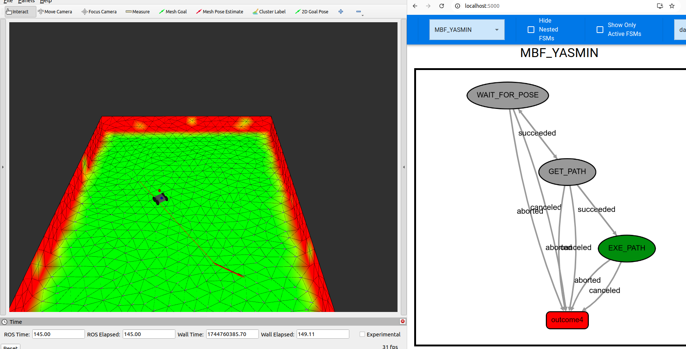

# MBF Yasmin (Python)

This example demonstrates how to trigger MBF actions from Yasmin using Python.

```bash
ros2 run mbf_yasmin_py navigate_to_pose --ros-args -p global_planner:=mesh_planner -p controller:=mesh_controller
```


The Yasmin viewer can be started with

```bash
ros2 run yasmin_viewer yasmin_viewer_node
```

and accessed via a web-browser: [http://localhost:5000/](http://localhost:5000/)


